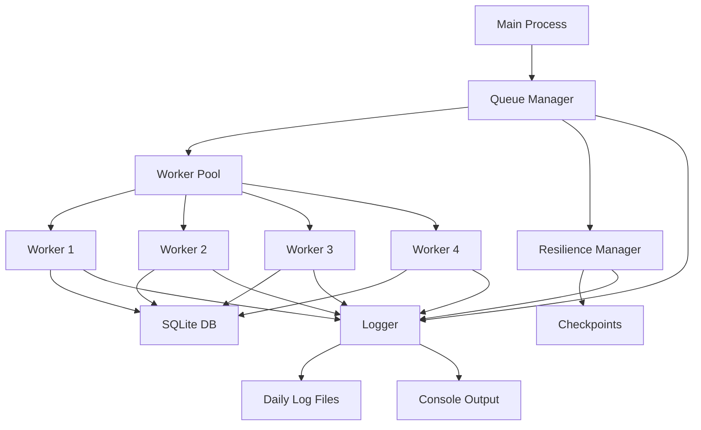
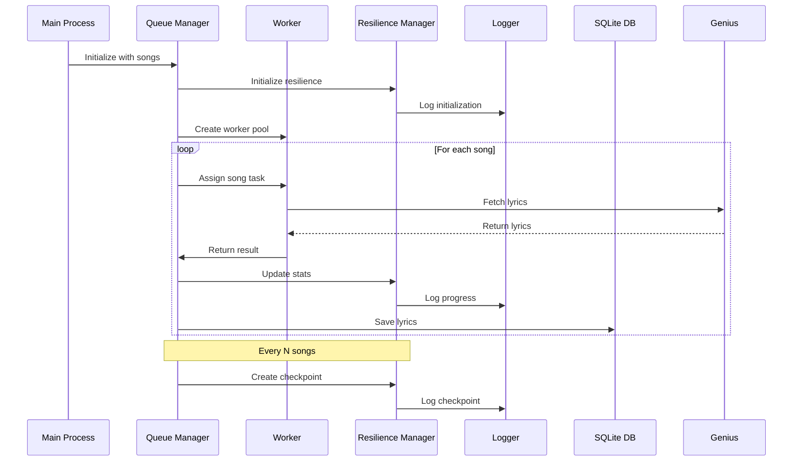
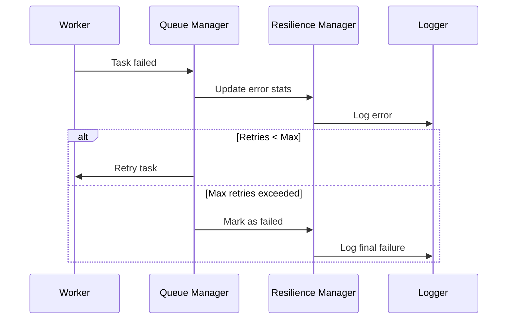

# Genius Lyrics Scraper

A high-performance, parallel lyrics scraping system using Node.js worker threads and SQLite, with built-in resilience features and comprehensive error handling. Used as a service for a ML app that uses music data.

## Table of Contents

- [Installation](#installation)
- [Quick Start](#quick-start)
- [Configuration](#configuration)
- [Architecture](#architecture)
- [Advanced Usage](#advanced-usage)
- [Resilience Features](#resilience-features)
- [Troubleshooting](#troubleshooting)

## Installation

### Prerequisites

- Node.js v16.0.0 or higher
- SQLite3

### Setup

1. Clone the repository:

```bash
git clone https://github.com/yourusername/genius-lyrics-scraper
cd genius-lyrics-scraper
```

2. Install dependencies:

```bash
npm install better-queue better-queue-sqlite sqlite3 axios cheerio genius-lyrics-api axios-rate-limit axios-retry
```

3. Set up your configuration in `src/config.js`:

```javascript
module.exports = {
  GENIUS_API_KEY: "your_api_key",
  WORKER_COUNT: 4,
  RATE_LIMIT: {
    maxRequests: 10,
    perMilliseconds: 60000,
  },
  RESILIENCE: {
    checkpointInterval: 10, // Create checkpoint every 10 successful tasks
    maxRetries: 3,
    retryDelay: 5000,
    errorThreshold: 0.1, // 10% error rate threshold
  },
};
```

## Quick Start

1. Add your songs to `src/genius.js`:

```javascript
const songsToScrape = [
  { title: "Blinding Lights", artist: "The Weeknd" },
  // Add more songs...
];
```

2. Run the scraper:

```bash
node src/genius.js
```

## Architecture

### System Components

#### 1. Core Components (`/src/core/`)

- **Resilience Manager**: Handles checkpointing and recovery
- **Error Handler**: Custom error types and handling
- **State Manager**: Tracks system state and progress

#### 2. Utils (`/src/utils/`)

- **Logger**: JSON-based logging with rotation
- **Helpers**: Various utility functions

#### 3. Main Components (`/src/`)

- **Queue Manager**: Task distribution and worker management
- **Worker System**: Parallel processing units
- **Database Layer**: Data persistence
- **Main Orchestrator**: System coordination

### Data Flow



### Process Flow



### Error Recovery Flow



### System Snapshot

1. **Initialization Phase**

   - Queue Manager starts
   - Workers are created
   - Resilience Manager initializes
   - Logger starts with daily rotation

2. **Processing Phase**

   - Tasks distributed to workers
   - Real-time logging of progress
   - Stats tracking per task
   - Checkpoints every N songs

3. **Monitoring Points**

   ```
   Worker → Queue (Task completion)
   └→ Resilience (Stats update)
      └→ Logger (Progress log)
         └→ Checkpoint (Every N tasks)
   ```

4. **Recovery Points**
   ```
   Error Detection → Retry Logic → Stats Update
                  └→ Checkpoint Creation
                  └→ Log Entry
   ```

## Resilience Features

### 1. Checkpointing System

- Automatic state saving
- Progress persistence
- Recovery from failures
- Configurable intervals

### 2. Error Handling

- Custom error types
- Rate limit handling
- Retry mechanisms
- Error tracking

### 3. Logging

- JSON-structured logs
- Daily rotation
- Console and file output
- Detailed error tracking

### 4. State Management

- Progress tracking
- Performance metrics
- Resource monitoring
- Task state persistence

## Advanced Usage

### Custom Worker Count

Modify `WORKER_COUNT` in `config.js`:

```javascript
module.exports = {
  WORKER_COUNT: 8, // Increase for more parallel processing
};
```

### Rate Limit Adjustment

```javascript
RATE_LIMIT: {
    maxRequests: 15,    // Requests per window
    perMilliseconds: 60000  // Window size (1 minute)
}
```

### Checkpoint Configuration

```javascript
RESILIENCE: {
    checkpointInterval: 20,  // Checkpoint every 20 songs
    maxRetries: 5,          // Maximum retry attempts
    retryDelay: 10000      // Delay between retries (ms)
}
```

## Troubleshooting

### Common Issues

1. **Rate Limiting**

   - Symptom: Many 429 errors
   - Solution: Reduce `maxRequests` in config
   - Check: View rate limit logs in `data/logs`

2. **Memory Issues**

   - Symptom: Process crashes with out of memory
   - Solution: Reduce `WORKER_COUNT` or batch size
   - Monitor: Check process memory usage

3. **Database Locks**
   - Symptom: SQLITE_BUSY errors
   - Solution: Increase SQLite timeout value
   - Verify: Check checkpoint creation logs

### Error Handling Layers

1. **Worker Level**

   - Individual task retries
   - Error isolation
   - Rate limit handling
   - Worker crash recovery

2. **Queue Level**

   - Task persistence
   - Automatic retries
   - Failed task logging
   - State recovery

3. **System Level**
   - Graceful shutdown
   - Process recovery
   - Data consistency
   - Checkpoint management
